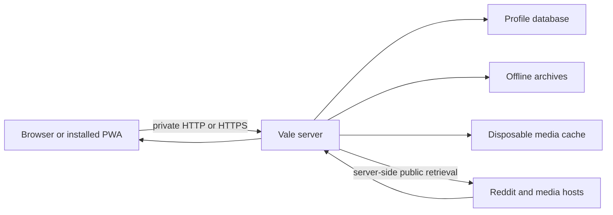
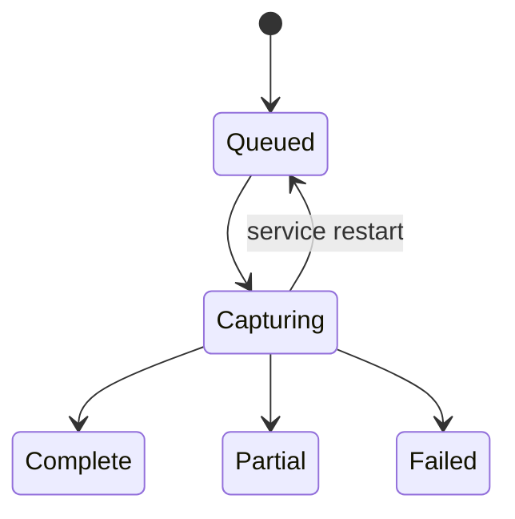

# Using Vale

Vale is a reader for a small, deliberate set of communities. It is not a
replacement for a Reddit account: you read public Reddit content through the
Vale server, while Vale accounts hold only Vale profile state.

## How a request moves

The browser normally talks only to the Vale origin. Dynamic pages and profile
data are private and are not stored in the service worker cache. Reddit media
is fetched through Vale's same-origin proxy. The external retrieval path is
unofficial and can be rate-limited or unavailable even when Vale itself is
healthy.

## The main destinations

### My feed

**My feed** shows the currently selected named feed. Use the feed chooser to
switch topics and the sort control to choose Hot, New, Top, Rising, or
Controversial. A feed contains only the communities assigned to it. An empty
feed stays empty; it does not silently fall back to All or Popular.

The same feed chooser remains available at every width. On phones, a compact
visual reminder pins below the real header only after the feed hero scrolls
away; it adds no second navigation control and does not cover keyboard, hash,
or restored reading targets.

The selected feed is device-local so choosing a topic on a phone does not
change the topic open on a desktop. Feed definitions, memberships, and other
profile settings synchronize after sign-in.

### Feeds

Open **Feeds** to create, rename, or remove named feeds and assign communities.
There can be up to eight named feeds and 32 assigned communities in one
profile. A community assigned to another feed moves rather than being silently
duplicated. Removing a feed does not unfollow its communities; assign them to a
new feed when you are ready to read them again.

**Find a community** opens all-Reddit community search. The former Discover
destination is retired; saved `/discover` links redirect to that canonical
search instead of maintaining a separate discovery surface.

Use a short topic name such as `Programming` or `Photography`, then add the
community names without the `r/` prefix. Save the change and return to **My
feed** to confirm that only the intended communities appear.

### Search

Search is named-feed scoped by default. The result URL records the query,
scope, feed, and sort so it can be bookmarked or shared. Select the explicit
all-Reddit scope only when you intend to search outside your named feeds.
Results identify whether a community belongs to the current feed, another
feed, or no named feed.

Comment search is available on a local post. It searches currently searchable
comment bodies, preserves each match's thread context, and reports incomplete
coverage when Reddit has more replies to load. A query is limited to 160
characters.

Community pages place the icon and name, member and active counts, optional
Wiki and Filter links, and an initially closed sanitized About disclosure in a
community information rail. The hero alone owns Follow and the community
description. The rail moves before posts on narrow layouts and stays beside
them on wide layouts. Icons and embedded About images are served only through
Vale's same-origin media paths; unsafe markup and unapproved image sources are
removed.

## Read without losing your place

### Inline posts and media

Post titles open Vale's local discussion page. Depending on the post, the
primary card control can expand submitted text, an image, a gallery, a GIF, or
a video in place. Collapse it with the same control; the URL, card identity,
and reading position remain stable.

- Images and GIFs use responsive Reddit previews and defer the full media until
  you expand the card. **Download original** preserves the original file.
- Galleries offer **Download all**, limited to 20 files, 64 MiB per file, and
  192 MiB per archive.
- Ordinary videos use Vale's bundled HLS engine when available and validated
  native HLS otherwise. Vale requires the selected stream to advertise audio;
  it shows a stable Retry/Settings explanation instead of silently playing a
  video-only MP4. GIF animation deliberately uses Reddit's MP4 derivative.
  Explicit ordinary-video download copy-remuxes the HLS video and required
  audio without re-encoding. It requires FFmpeg in the runtime environment;
  see [Troubleshooting](OPERATIONS.md#troubleshooting) if playback works but
  download does not.
- Self-posts expose complete submitted text with **Read post**. This is an
  explicit disclosure, not an automatic preview.

The source link is available when you deliberately want to leave Vale. Do not
assume that a source link has the same privacy or tracking properties as the
Vale page.

### Discussions and comment continuations

Post and combined-discussion pages render comments as one ordered thread. The
interface may initially show a continuation control when Reddit has not
returned every branch. Choose **Load more replies** to fetch a branch in place;
the post URL does not change. A failed request leaves the control available for
retry.

Top-level comments remain visible when child-tree collapsing is enabled. Use a
reply disclosure to show or hide its complete flat descendant range. On narrow
screens, indentation is intentionally shallow; depth and parent links preserve
context without forcing the page to scroll horizontally.

Comment keyword filters hide only matching bodies. Author, score, timestamp,
thread structure, and replies remain visible. Reveal one filtered body or all
filtered bodies in the current thread, then hide them again if needed. Filters
allow up to 30 phrases of 60 characters each.

When a named feed contains exact copies of one source URL or an exact Reddit
crosspost identity, Vale may combine the cards into a **combined discussion**.
It keeps each source thread and labels its community. Similar titles, fuzzy
text, redirect guesses, or different publishers never cause an automatic
merge. A combined card retains at most 12 directly linked source-comment
identities and reports any additional count honestly instead of silently
dropping it.

## Hide, history, and Saved

### Hide

Choose **Hide** on a card to remove it from your profile's listings. The action
is immediate and **Undo** can restore up to 12 recent cards. Hidden posts are
profile-scoped and can be restored from **Settings**. The native profile limit
is 20,000 hidden post IDs.

Vale then replenishes an eligible listing in place without replacing surviving
cards, expanded content, focus, or the reading anchor. It may inspect up to four
25-record Reddit pages to produce at most 25 eligible representatives. If that
bounded pass cannot finish, the visible cards remain usable and the listing
offers an explicit Retry instead of pretending it reached the end.

On a signed-in profile, hide state follows you to another device. In browser
mode, hide state is a smaller device cookie and does not provide the same
profile synchronization.

### History

Opening a local post records it in **History** for the signed-in profile.
History is retained for 180 days and capped at 5,000 distinct posts. Clear it
from **History** when you want to remove the profile's reading record. History
does not mean unread state, and hiding a post does not mark it read.

### Saved / offline archives

On a local post page, choose **Save offline** to queue a profile-owned archive.
The background worker captures the post, comments, Reddit JSON, and available
media. **Saved** displays the capture status:

An archive contains a standalone `index.html`, a machine-readable manifest,
source addresses, byte counts, SHA-256 checksums, and captured files. Reader v3
also bundles its Vale mark, Source Sans 3 and Source Serif 4 fonts, and offline
license notices as separately identified generated assets. It is script-free,
dark by default, follows a light system preference, prints as light paper, and
uses one closed CSP in the HTML and HTTP response. Headings in each archived
comment and reply branch are normalized beneath the reader's own outline;
ambiguous captured HTML falls back to escaped source Markdown and records an
archive issue. Open it from disk without Reddit or a running Vale process.
Version-1 and Reader-v2 archives remain readable without being rewritten.

The default limits are one GiB per archive and two GiB for the complete archive
store. In **Settings → Archive storage**, a profile may share the instance
maximum or choose a whole 256 MiB step from 256 MiB through that maximum. The
effective limit is the lower of the profile selection and current instance
maximum. Existing saves remain readable if a limit is lowered; new captures
pause until used plus reserved space fits again. **Saved** shows exact durable
bytes, temporary reservations, the effective profile limit, and the shared
instance maximum.

Admission atomically records a fixed reservation before a bounded worker can
start. A capture must have at least 64 MiB available and keeps 64 MiB for final
reader/manifest overhead. Later cap changes do not revoke an admitted job.
Final publish, cleanup, deletion, and startup recovery retain accounting until
the archive directory and database agree. Archive metadata is capped at 500
records per profile and 5,000 records for the instance. At a metadata cap Vale
may remove only the requesting profile's oldest failed retry record; it never
automatically deletes another profile's record or a readable/pending archive.
A capture retrieves at most 5,000 comments through at most 30 continuation
requests. External HTML is sanitized and best-effort; scripts and arbitrary
linked resources are not executed. A partial result is honest about omissions
and is not presented as complete.

Archives are durable profile data, not disposable media cache. Treat them as
potentially sensitive: they can contain content that later disappears from
Reddit and may be readable by anyone who can access the archive directory.

## Accounts and settings

The first account created at `/setup` is the owner administrator. There is no
public registration. An administrator can create independent accounts from
**Settings**, optionally clone the administrator's current profile once, disable
or re-enable an account, and reset its password. Each account has its own
feeds, filters, preferences, history, hidden posts, and archives.

Passwords must be 12–128 characters and are stored as salted Argon2id hashes.
Sessions use random tokens whose hashes are stored in the profile database.
Signing out all devices, changing a password, resetting a password, or
disabling an account revokes the affected sessions.

### Keyboard navigation

Keyboard navigation is enabled by default for feed cards:

| Key | Action |
| --- | --- |
| `j` | Select the next post |
| `k` | Select the previous post |
| `Enter` | Open the local discussion |
| `e` | Expand or collapse inline content |
| `h` | Hide the selected post |

Shortcuts pause while a form, link, button, or media control has focus. Change
the bindings or disable keyboard navigation in **Settings**.

On a phone, changing a main preference reveals an opaque bottom **Save
settings** bar only while the form is dirty, on screen, and the native Save
control remains below its boundary. Reverting every field hides it again. The
bar submits the same native form; account, archive, feed, backup/restore, and
Clear-hidden actions keep their separate endpoints and confirmations.

### Backup and restore settings

The **Backup and restore** panel exports profile preferences in the `VAL1`
format. Store the downloaded file privately. Restore accepts the current
format and supported older Vale-compatible formats, then canonicalizes retired
presentation values. A preferences export is not a database backup: it does
not contain accounts, password hashes, sessions, history, hidden posts, or
offline archives.

## Install Vale as a PWA

After signing in through the final HTTPS origin, use the browser's **Install**
or **Add to Home Screen** command. Install it from the origin you will keep;
an installed PWA belongs to that origin and does not automatically follow a
hostname migration. The service worker caches only immutable shell assets. It
does not make profile pages, feeds, comments, or media available offline.

## Privacy boundaries to remember

- Vale's native account is separate from Reddit; no Reddit credentials are
  stored or required.
- The Vale server can see requests needed to retrieve public Reddit content and
  stores the profile data described above.
- Another administrator of the host can access the database, archives, cache,
  logs, and backups. Protect the host and backup destination accordingly.
- Explicit source links leave Vale and may expose your browser to the source
  site's own cookies, tracking, or content policy.
- Reddit can rate-limit or change the unofficial retrieval flow. A Reddit error
  is not proof that your account, archive, or password is broken.
